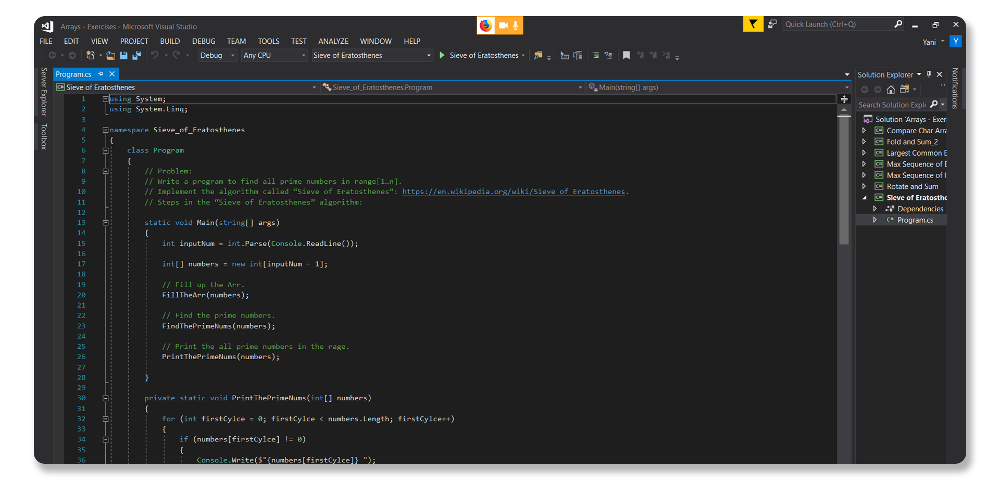

<h1 align="center">My education in Software University</h1>

<h2 align="center"></h2>

 

  

  

  

  

 
                                                                     

  

  <a href="Tech Module/02.Software Technologies/">
                                                                                                                                                 

 
               

Coming Soon

